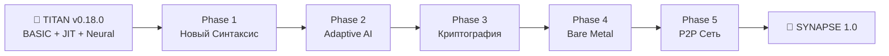
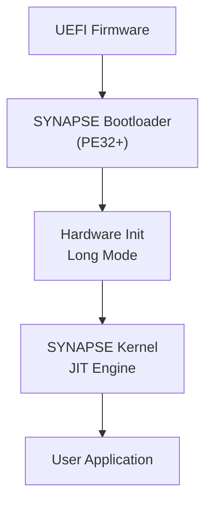

# SYNAPSE ROADMAP

**Цель:** Трансформировать TITAN в безопасный, AI-нативный язык "без ОС"  
**База:** TITAN v0.18.0 (21 KB, FASM)  
**Статус:** В разработке

---

## Обзор Эволюции



---

## 🏗️ Phase 1: Рефакторинг и Новое Лицо (The Shift)

**Цель:** Отвязаться от BASIC-синтаксиса и подготовить кросс-платформенную архитектуру

**Статус:** ⏳ Планируется

| # | Задача | Описание | Статус |
|---|--------|----------|--------|
| 1.1 | **Platform Abstraction Layer (PAL)** | Собрать все вызовы `kernel32.dll` в `sys_interface.asm`. Позволит заменить на BIOS/UEFI позже | ⬜ |
| 1.2 | **Новый Лексер (Indentation)** | Научить лексер работать с отступами. Генерировать токены `INDENT` и `DEDENT` | ⬜ |
| 1.3 | **Парсер Типов** | Заменить `DIM A(10)` на `let x: tensor<10>`. Таблица символов с типами | ⬜ |
| 1.4 | **Синтаксис v0.1** | Реализовать: `fn`, `let`, `mut`, `if/else`, `loop`, `return` | ⬜ |
| 1.5 | **JIT-адаптация** | Перенастроить генератор кода для нового AST | ⬜ |

### Сравнение Синтаксиса

**TITAN (BASIC):**
```basic
DIM W(100352)
LET A = 10
FUNC FACT
LOCAL R
...
ENDFUNC
```

**SYNAPSE (Modern):**
```synapse
let w: tensor<f32, [100352]>
let a: int = 10

fn fact(n: int) -> int:
    if n <= 1:
        return 1
    return n * fact(n - 1)
```

**Результат фазы:** Компилятор с синтаксисом SYNAPSE, работающий на движке TITAN

---

## 🧠 Phase 2: Адаптивный Нейро-Движок (Adaptive AI)

**Цель:** Внедрить "умную" компиляцию под разные процессоры

**Статус:** ⏳ Планируется

| # | Задача | Описание | Статус |
|---|--------|----------|--------|
| 2.1 | **CPUID Detector** | Модуль определения железа: `HAS_AVX2`, `HAS_AVX512`, `HAS_VNNI`, `HAS_AMX` | ⬜ |
| 2.2 | **Тип `tensor`** | Примитивный тип тензора. Авто-выравнивание (32 байта AVX2, 64 байта AVX-512) | ⬜ |
| 2.3 | **Adaptive JIT** | Ветвления в генераторе: `if (CPU_TIER == 1) emit(VPDPBUSD) else emit(VPMADDUBSW)` | ⬜ |
| 2.4 | **Тип `quant8`** | 8-битные веса для нейросетей. Поддержка VNNI (ускорение ×4) | ⬜ |
| 2.5 | **Auto-Differentiation** | Автоматическое вычисление градиентов для обучения сетей | ⬜ |

### Адаптивная Генерация Кода

**Сценарий А (Ryzen 5950X, Zen 3 — AVX2):**
```asm
VMULPS ymm0, ymm1    ; 8 чисел за раз
```

**Сценарий Б (Ryzen 9 7950X, Zen 4 — AVX-512):**
```asm
VMULPS zmm0, zmm1    ; 16 чисел за раз
```

**Результат фазы:** Программа автоматически работает быстрее на новом железе

---

## 🔗 Phase 3: Память и Криптография (The Ledger)

**Цель:** Превратить память в защищённый блокчейн

**Статус:** ⏳ Планируется

| # | Задача | Описание | Статус |
|---|--------|----------|--------|
| 3.1 | **Crypto Primitives** | Оптимизированные **SHA-256** (или BLAKE3) и **Ed25519** на ASM | ⬜ |
| 3.2 | **Merkle Allocator** | Заменить обычный `malloc`. Каждый блок памяти хешируется | ⬜ |
| 3.3 | **Time-Travel (Rollback)** | Команда `rollback()` — смена указателя корня дерева Меркла | ⬜ |
| 3.4 | **Code Signing** | Запрет запуска JIT-кода без подписи ключом разработчика | ⬜ |

### Merkle Tree Memory

```
                    [Root Hash]
                    /          \
            [Hash A]            [Hash B]
            /      \            /      \
       [Block1] [Block2]   [Block3] [Block4]
          ↓        ↓          ↓        ↓
        data     data       data     data
```

**Результат фазы:** Неубиваемая программа с откатом состояния

---

## 💾 Phase 4: Bare Metal (No-OS)

**Цель:** Запустить SYNAPSE без операционной системы

**Статус:** ⏳ Планируется

| # | Задача | Описание | Статус |
|---|--------|----------|--------|
| 4.1 | **UEFI Bootloader** | Загрузчик на FASM (PE32+), инициализация, Long Mode | ⬜ |
| 4.2 | **Physical Memory Manager** | Управление физическими страницами RAM без ОС | ⬜ |
| 4.3 | **Video Driver (GOP)** | Прямой вывод пикселей через Graphics Output Protocol | ⬜ |
| 4.4 | **Keyboard Driver** | Опрос портов ввода/вывода для клавиатуры | ⬜ |
| 4.5 | **Интеграция** | Вшить компилятор в ядро загрузчика | ⬜ |

### Структура Загрузки



**Результат фазы:** Загрузочный ISO, можно записать на флешку и запустить

---

## 🌐 Phase 5: P2P Сеть (Synapse Net)

**Цель:** Связать машины без серверов

**Статус:** ⏳ Планируется

| # | Задача | Описание | Статус |
|---|--------|----------|--------|
| 5.1 | **Network Driver** | Драйвер сетевой карты (Intel E1000 для QEMU, Realtek) | ⬜ |
| 5.2 | **Raw Sockets** | Работа с Ethernet-фреймами напрямую | ⬜ |
| 5.3 | **Sync Protocol** | Протокол синхронизации переменных `ledger` между машинами | ⬜ |
| 5.4 | **Node Discovery** | Обнаружение других узлов SYNAPSE в сети | ⬜ |
| 5.5 | **Consensus** | Простой консенсус для распределённого состояния | ⬜ |

**Результат фазы:** Приложения SYNAPSE синхронизируют данные без центрального сервера

---

## 📊 Прогресс

### Наследие от TITAN v0.18.0

| Компонент | Статус | Примечание |
|-----------|--------|------------|
| JIT Engine | ✅ Готов | Переносится в SYNAPSE |
| AVX2 SIMD | ✅ Готов | Расширяется до AVX-512 |
| MATMUL/VRELU | ✅ Готов | Становится `tensor<dot>` |
| FFI Windows | ✅ Готов | Выносится в PAL |
| Heap Memory | ✅ Готов | Модернизируется в Merkle |
| BLOAD/BSAVE | ✅ Готов | Переносится |

### Общий Прогресс SYNAPSE

```
Phase 1 [░░░░░░░░░░] 0%  — Новый Синтаксис
Phase 2 [░░░░░░░░░░] 0%  — Adaptive AI
Phase 3 [░░░░░░░░░░] 0%  — Криптография
Phase 4 [░░░░░░░░░░] 0%  — Bare Metal
Phase 5 [░░░░░░░░░░] 0%  — P2P Сеть
```

---

## 🎯 Приоритеты

1. **Ближайшая цель:** Phase 1.1 — Platform Abstraction Layer
2. **Ключевая веха:** Phase 1 завершена → Компилятор с новым синтаксисом
3. **Финальная цель:** Phase 5 → SYNAPSE 1.0 Release

---

## 📝 Заметки по Реализации

### Файлы для Модификации (Phase 1)

| Файл TITAN | Изменение |
|------------|-----------|
| `src/lexer.asm` | Добавить INDENT/DEDENT, новые токены |
| `src/parser.asm` | Новая грамматика, типизация |
| `src/jit.asm` | Адаптация под новый AST |
| `src/memory.asm` | Подготовка к Merkle Heap |
| `sys_interface.asm` | **Новый файл** — PAL |

### Новые Файлы SYNAPSE

| Файл | Назначение |
|------|------------|
| `src/types.asm` | Система типов |
| `src/tensor.asm` | Тензорные операции |
| `src/crypto.asm` | SHA-256, Ed25519 |
| `src/merkle.asm` | Merkle Tree Allocator |
| `boot/uefi.asm` | UEFI загрузчик |

---

*© 2025 mjojo & GLK-Dev. SYNAPSE Roadmap.*
