# SYNAPSE ROADMAP: POST-SINGULARITY ERA

**Статус:** v3.4.0-NERVOUS — Phase 55.8 Complete ✅ (IAT Call Generation Working!)  
**Достижение:** ExitProcess(42) через IAT — нервная система компилятора работает!  
**Философия:** "Прагматизм сегодня + Инновации завтра" — строим стабильное ядро с расширяемой архитектурой  
**Парадигма:** "Безопасность на уровне ДНК" — защита встроена в компилятор, не добавляется позже  
**Лицензия:** Dual Licensing (Apache 2.0 + AGPL v3) — защита от корпораций, свобода для разработчиков

---

## 📜 Лицензионная Модель

**Synapse** использует **стратегию двойного лицензирования** для баланса между открытостью и устойчивостью:

### 1️⃣ Apache License 2.0 (Компилятор и Язык)
- ✅ **Использование:** Создание коммерческих приложений без ограничений
- ✅ **Цель:** Максимальное распространение, zero friction для разработчиков
- ✅ **Защита:** Patent Grant — если кто-то подает патентный иск, теряет лицензию
- **Компоненты:** Compiler, JIT, StdLib (core/io/math/string/crypto)

### 2️⃣ AGPL v3 (Облачные Сервисы)
- 🛡️ **"Ядерный щит":** Защита от Amazon/Google/Azure
- 🛡️ **Правило:** Используешь в облаке → открой код или купи коммерческую лицензию
- 🛡️ **Цель:** Предотвратить "Cloud Loophole" (модель MongoDB/Elastic)
- **Компоненты:** SynapseFS, Synapse Chain, Hive Protocol, P2P Sync

### 3️⃣ Commercial License (Enterprise)
- 💰 Для компаний, которым нужны облачные модули без раскрытия кода
- 💰 Включает: SLA, кастомные фичи, приоритетную поддержку

**Почему это работает:** Модель **MongoDB** — язык свободен (популярность ⬆), сервисы защищены (бизнес 💰).  
**Детали:** См. [LICENSE](../LICENSE) в корне проекта.

---

## 🛡️ Концепция: "Synapse" — Единое Имя

**Synapse** — это не просто язык или ОС. Это **Экосистема**:
- **Synapse Language** — компилятор и синтаксис
- **Synapse OS** — операционная система (bare metal)
- **Synapse Chain** — блокчейн-память и файловая система
- **Synapse Paint** — графический редактор (Phase 46 legacy)
- **Synapse Ecosystem** — единый организм от микроконтроллера до ОС

**Философия безопасности:**
- Не ставим антивирус — делаем архитектуру, где вирус не может выжить
- Каждый EXE уникален (Polymorphic Compilation)
- Память защищена криптографически (Merkle Tree Allocator)
- Файловая система самовосстанавливается (TitanFS → SynapseFS)

---

## 🎯 Общая Стратегия: "Synapse Universal"

Мы строим не просто "еще один компилятор", а **универсальную систему компиляции** для:
- **Десктопа** (Windows/Linux/macOS)
- **Встраиваемых систем** (ARM, RISC-V, AVR)
- **Bare Metal** (UEFI, загрузчики, микроконтроллеры)
- **AI-интеграции** (LLM, нейросети, генетические алгоритмы)

### Обзор Эволюции

```mermaid
graph LR
    TITAN["🔷 TITAN v0.18.0<br/>BASIC + JIT"]
    P50["Phase 50<br/>PE Generation"]
    P51["Phase 51<br/>Standalone EXE"]
    P52["Phase 52<br/>IAT Working ✅"]
    P53["Phase 53<br/>Memory ✅"]
    P55["Phase 55.8<br/>IAT Calls ✅"]
    P56["Phase 55.9<br/>Hello World"]
    P60["Phase 60<br/>AI-Native"]
    P70["Phase 70<br/>Multi-Arch"]
    P100["Phase 100<br/>Titan OS"]
    
    TITAN --> P50 --> P51 --> P52 --> P53 --> P55 --> P56 --> P60 --> P70 --> P100
    
    style P55 fill:#0f0
```



**Где мы сейчас:** Phase 55.8 ✅ → Phase 55.9 (Hello World via WriteFile) — следующая цель

---

## �️ ЭРА 1: ФУНДАМЕНТ (The Foundation)
**Цель:** Стабильное ядро на x64 с архитектурой, готовой к мультиплатформенности  
**Период:** 1-2 недели  
**Статус:** 🟢 В процессе (Phase 53)

### Phase 53: The Cortex (Память и Стабильность) 🔄 NEXT

**Цель:** Заставить работать динамическую память в сгенерированных исполняемых файлах

**Статус:** ⏳ В разработке

| # | Задача | Описание | Статус |
|---|--------|----------|--------|
| 53.1 | **Stack Alignment Fix** | Добавить `SUB RSP, 40` (Win64 Shadow Space + выравнивание) перед вызовами API | ⬜ |
| 53.2 | **VirtualAlloc Call** | Проверить параметры: RCX=0, RDX=size, R8=0x3000, R9=4 | ⬜ |
| 53.3 | **Heap Testing** | Программа выделяет массив 1000 элементов, заполняет, выводит | ⬜ |
| 53.4 | **Memory Manager Abstraction** | Подготовить интерфейс, независимый от платформы (будущий mmap на Linux) | ⬜ |

**Прагматика:** Программы получают динамическую память (heap)  
**Взгляд в будущее:** Менеджер памяти будет одинаково работать на Windows (VirtualAlloc), Linux (mmap), Bare Metal (физические страницы)

**Тест:** `arrays.syn` компилируется в `arrays.exe` и успешно сортирует массив

---

### Phase 54: The Senses (Файловый Ввод/Вывод)

**Цель:** Научить скомпилированные EXE читать и писать файлы

**Статус:** ⏳ Запланировано

| # | Задача | Описание | Статус |
|---|--------|----------|--------|
| 54.1 | **Expand IAT** | Добавить в Import Table: `CreateFileA`, `ReadFile`, `WriteFile`, `CloseHandle` | ⬜ |
| 54.2 | **File Intrinsics** | Реализовать `fopen`, `fread`, `fwrite`, `fclose` для генерируемых программ | ⬜ |
| 54.3 | **Stream Abstraction** | Единый интерфейс для файлов, сокетов, serial-портов: `stream.read()` | ⬜ |
| 54.4 | **Utilities Testing** | Создать `cat.exe` (читает файл), `cp.exe` (копирует файл) | ⬜ |

**Прагматика:** Программы взаимодействуют с файловой системой  
**Взгляд в будущее:** Абстракция "потоков" позволит читать файлы, сеть и устройства одинаково

**Тест:** `cat.syn` компилируется в `cat.exe`, читает `test.txt` и выводит в консоль

---

### Phase 55: The Nervous System (IAT Call Generation) 🧠⚡

**Цель:** Научить сгенерированные EXE вызывать Windows API через IAT

**Статус:** ✅ Steps 6-8 Complete!

| # | Задача | Описание | Статус |
|---|--------|----------|--------|
| 55.1 | **Bootstrap Compiler** | Создать `bootstrap.syn` — минимальный самокомпилирующийся компилятор | ✅ |
| 55.2 | **Lexer** | Токенизация исходного кода (ident, number, string, operators) | ✅ |
| 55.3 | **Parser** | Парсинг let, if, while, fn, return, print | ✅ |
| 55.4 | **Codegen** | Генерация x64 машинного кода | ✅ |
| 55.5 | **PE Header** | Полноценный PE32+ заголовок с секциями | ✅ |
| 55.6 | **PE Builder** | `emit_pe_header()` в Synapse — генерация DOS/PE/Sections | ✅ |
| 55.7 | **Import Generator** | `emit_import_table()` — IAT с 8 функциями KERNEL32.DLL | ✅ |
| 55.8 | **The Caller** | `emit_iat_call()` — RIP-relative CALL через IAT | ✅ |
| 55.9 | **Hello World** | WriteFile через IAT — вывод в консоль | ⬜ |
| 55.10 | **Self-Hosting** | compiler_v1.exe → compiler_v2.exe → verification | ⬜ |

**Достижение:** `output.exe` успешно вызывает `ExitProcess(42)` через IAT! 🎉

**Ключевые функции:**
- `emit_iat_call(state, index)` — генерирует `FF 15 xx xx xx xx` (CALL [RIP+disp32])
- `emit_stack_setup()` — SUB RSP, 40 (Windows x64 ABI shadow space)
- RIP-relative displacement: `target_RVA - (current_RVA + 6)`

**IAT Functions (RVA 0x2028):**
| Index | Function | Usage |
|-------|----------|-------|
| 0 | ExitProcess | ✅ Working! |
| 1 | VirtualAlloc | Memory allocation |
| 2 | VirtualFree | Memory deallocation |
| 3 | WriteFile | Console/file output |
| 4 | ReadFile | File input |
| 5 | CreateFileA | File operations |
| 6 | CloseHandle | Handle cleanup |
| 7 | GetStdHandle | Console handles |

**Тест:** 
```bash
synapse_new.exe examples/exit_call_demo.syn
output.exe
echo %ERRORLEVEL%  # Returns 42
```

---

## 🐙 ЭРА 2: ПОЛИМОРФИЗМ (Multi-Arch & AI Integration)
**Цель:** Мультиплатформенность + AI-возможности  
**Период:** 1-2 месяца  
**Статус:** 🔵 Запланировано

### Phase 56: The Backend Split (Архитектурная Независимость)

**Цель:** Разделить компилятор на Frontend (парсинг) и Backend (генерация кода)

**Статус:** ⏳ Запланировано

| # | Задача | Описание | Статус |
|---|--------|----------|--------|
| 56.1 | **IR Design** | Создать промежуточное представление (AST → IR → Machine Code) | ⬜ |
| 56.2 | **Backend Interface** | Определить API бэкенда: `emit_add(a, b)`, `emit_call(fn)`, `emit_ret()` | ⬜ |
| 56.3 | **x64 Backend** | Перенести текущий `codegen.asm` → `backend_x64.syn` | ⬜ |
| 56.4 | **ARM64 Backend** | Создать `backend_arm64.syn` (для Apple Silicon, Raspberry Pi, Android) | ⬜ |
| 56.5 | **RISC-V Backend** | Создать `backend_riscv.syn` (для ESP32-C3, будущих чипов) | ⬜ |

**Прагматика:** Один исходник → несколько платформ  
**Взгляд в будущее:** Добавление новой архитектуры = написание нового бэкенда (100-200 строк)

**Тест:** `hello.syn` компилируется в:
- `hello_x64.exe` (Windows)
- `hello_arm64` (Linux ARM / Raspberry Pi)
- `hello_riscv.bin` (Bare Metal RISC-V)

---

### Phase 57: The Standard Library (StdLib)

**Цель:** Перестать использовать "магические" интринсики, перейти на импорты

**Статус:** ⏳ Запланировано

| # | Задача | Описание | Статус |
|---|--------|----------|--------|
| 57.1 | **Core Module** | `std/core.syn` — типы, память, системные вызовы | ⬜ |
| 57.2 | **I/O Module** | `std/io.syn` — File, Console, Path, Stream | ⬜ |
| 57.3 | **Math Module** | `std/math.syn` — float/double, sin/cos/sqrt (через msvcrt.dll) | ⬜ |
| 57.4 | **String Module** | `std/string.syn` — concat, substring, split, parse | ⬜ |
| 57.5 | **Collections** | `std/vector.syn`, `std/map.syn` — динамические структуры данных | ⬜ |
| 57.6 | **Crypto Module** | `std/crypto.syn` — SHA-256, Ed25519, хеширование файлов | ⬜ |

**Прагматика:** Чистый, читаемый код пользователя  
**Взгляд в будущее:** Криптография закладывается сейчас для Phase 65 (Code Signing) и Phase 67 (SynapseFS)  
**Итог:** `import "std/io"; println("Hello");` вместо "магических" интринсиков

---

### Phase 58: AI-Intrinsics (Нейросети в Языке)

**Цель:** Встроить поддержку AI/ML операций на уровне языка

**Статус:** ⏳ Запланировано

| # | Задача | Описание | Статус |
|---|--------|----------|--------|
| 58.1 | **Tensor Type** | Примитивный тип `tensor<f32, [128, 128]>` с авто-выравниванием | ⬜ |
| 58.2 | **SIMD Intrinsics** | AVX2/AVX-512 операции: `matmul`, `relu`, `softmax` | ⬜ |
| 58.3 | **llama.cpp Integration** | Подключение локальных LLM через DLL | ⬜ |
| 58.4 | **AI-Syntax** | Естественный язык внутри кода: `@ai "Sort users by karma"` | ⬜ |
| 58.5 | **Auto-Differentiation** | Автоматическое вычисление градиентов для обучения | ⬜ |

**Инновация:** Компилятор не просто выдает ошибки — он **предлагает исправления**:
```
Error on line 10: Missing closing bracket
AI Suggestion: Added '}' and optimized loop. Apply? [y/n]
```

**Тест:** `neural.syn` — обучение простой нейросети прямо в compiled code

---

### Phase 60: The Oracle (AI-Native Compiler)

**Цель:** Компилятор, который понимает намерение программиста

**Статус:** ⏳ Запланировано (после Phase 58)

| # | Задача | Описание | Статус |
|---|--------|----------|--------|
| 60.1 | **Local LLM Embedding** | Встроить модель (llama.cpp) прямо в компилятор | ⬜ |
| 60.2 | **Semantic Error Messages** | Вместо "Error: undefined variable" → "Did you mean 'counter'?" | ⬜ |
| 60.3 | **Code Suggestions** | Автокомплит на основе контекста проекта | ⬜ |
| 60.4 | **Natural Language Functions** | Функции на естественном языке компилируются в оптимизированный код | ⬜ |

**Инновация:** Программирование как диалог с AI

---

### Phase 62: Memory Safety (Безопасность Памяти)

**Цель:** Сделать невозможными Buffer Overflow и Use-After-Free

**Статус:** ⏳ Запланировано

| # | Задача | Описание | Статус |
|---|--------|----------|--------|
| 62.1 | **Bounds Checking** | Автоматическая проверка границ массивов на этапе компиляции | ⬜ |
| 62.2 | **Pointer Authentication** | Шифрование указателей в памяти (как ARM PAC) | ⬜ |
| 62.3 | **Lifetime Analysis** | Rust-like borrow checker для Synapse | ⬜ |
| 62.4 | **Memory Tagging** | Каждый блок памяти помечается криптографически | ⬜ |

**Итог:** Компилятор не даст скомпилировать небезопасный код

---

### Phase 65: Polymorphic Defense (Живой Код)

**Цель:** Каждая скомпилированная программа уникальна на бинарном уровне

**Статус:** ⏳ Запланировано

| # | Задача | Описание | Статус |
|---|--------|----------|--------|
| 65.1 | **Instruction Shuffling** | Перемешивание порядка инструкций при сохранении логики | ⬜ |
| 65.2 | **Junk Code Injection** | Вставка безвредных NOP-sleds между инструкциями | ⬜ |
| 65.3 | **Register Randomization** | Случайный выбор регистров для одних и тех же операций | ⬜ |
| 65.4 | **Code Signing** | Каждый EXE подписывается ключом компилятора | ⬜ |

**Инновация:** Вирус, написанный под одну версию программы, не работает на другой (даже если исходник тот же)

---

### Phase 67: SynapseFS (Merkle Tree Filesystem)

**Цель:** Файловая система на блокчейне — неубиваемая и самовосстанавливающаяся

**Статус:** ⏳ Запланировано

| # | Задача | Описание | Статус |
|---|--------|----------|--------|
| 67.1 | **Merkle Tree Structure** | Каждый файл — лист в дереве Меркла | ⬜ |
| 67.2 | **Integrity Checking** | При загрузке ОС проверяет хеш всех системных файлов | ⬜ |
| 67.3 | **P2P Backup** | Блоки дублируются на соседние узлы в сети | ⬜ |
| 67.4 | **Rollback Support** | `fs.rollback(checkpoint)` — откат состояния файловой системы | ⬜ |
| 67.5 | **Tamper Detection** | Если хоть один бит изменен без подписи — система откатывает блок | ⬜ |

**Инновация:** "Format C:" больше не страшен — система восстанавливается из P2P-сети

**Архитектура SynapseFS:**
```
                [Root Hash — в загрузчике]
                    /              \
            [Dir: /sys]          [Dir: /home]
            /         \              /      \
     [kernel.exe]  [drivers/]  [user.dat] [docs/]
```

Каждый узел хешируется → изменение любого файла меняет Root Hash → невозможно подделать

---

## 🤖 ЭРА 3: ФИЗИЧЕСКИЙ МИР (Robotics & Embedded)
**Цель:** Выход за пределы десктопа — роботы, IoT, микроконтроллеры  
**Период:** 3+ месяца  
**Статус:** 🟣 Долгосрочное видение

### Phase 70: Synapse Embedded (Cross-Compilation для ARM/RISC-V)

**Цель:** Один язык для "мозга" (PC) и "нервов" (микроконтроллеры)

**Статус:** ⏳ Запланировано

| # | Задача | Описание | Статус |
|---|--------|----------|--------|
| 70.1 | **AVR Backend** | Генерация кода для Arduino (ATmega328P) | ⬜ |
| 70.2 | **ESP32 Support** | RISC-V бэкенд для ESP32-C3 (Wi-Fi микроконтроллер) | ⬜ |
| 70.3 | **Bare Binary Output** | Генерация "голого" кода без PE-заголовка (прошивка) | ⬜ |
| 70.4 | **Serial Protocol** | Коммуникация PC ↔ Robot через Serial/Wi-Fi | ⬜ |
| 70.5 | **Swarm Intelligence** | Протокол взаимодействия между роботами | ⬜ |

**Прагматика:** Робот-питомец работает на коде Synapse  
**Взгляд в будущее:** Единое адресное пространство — переменная на ПК видна на Arduino через Wi-Fi

**Тест:** `robot.syn` → `robot.bin`, загружается на ESP32, управляет сервоприводами

---

### Phase 75: Polymorphic Code (Живой Код)

**Цель:** Программа, которая эволюционирует во время работы

**Статус:** ⏳ Запланировано (экспериментально)

| # | Задача | Описание | Статус |
|---|--------|----------|--------|
| 75.1 | **Runtime JIT** | Перекомпиляция функций во время выполнения | ⬜ |
| 75.2 | **A/B Testing** | Программа генерирует варианты функции и тестирует производительность | ⬜ |
| 75.3 | **Genetic Optimization** | Лучший вариант перезаписывает медленный прямо в памяти | ⬜ |
| 75.4 | **Hot-Patching** | Программа читает свой исходник и патчит себя без перезапуска | ⬜ |

**Инновация:** Настоящая эволюция кода — программа становится быстрее во время работы

---

### Phase 95: The Hive Protocol (Роевой Консенсус)

**Цель:** Защита от взлома через распределенное доверие

**Статус:** ⏳ Запланировано

| # | Задача | Описание | Статус |
|---|--------|----------|--------|
| 95.1 | **Lightweight Consensus** | Алгоритм голосования между узлами (Proof of Authority) | ⬜ |
| 95.2 | **Byzantine Fault Tolerance** | Система работает, даже если 1/3 узлов взломана | ⬜ |
| 95.3 | **Trust Scoring** | Узлы с историей честного поведения имеют больший вес | ⬜ |
| 95.4 | **Swarm Memory** | Общая распределенная память между роботами/устройствами | ⬜ |

**Применение:** Если один дрон взломан и шлет неверные данные, рой игнорирует его  
**Инновация:** Взломать одного — легко. Взломать рой — математически невозможно.

---

## 🌌 ЭРА 4: ОПЕРАЦИОННАЯ СИСТЕМА (Synapse OS)
**Цель:** Bare Metal — ОС на Synapse  
**Период:** 6+ месяцев  
**Статус:** 🔮 Финальная цель

### Phase 80: Titan Graphics (Векторный Движок)

**Цель:** Графика без тяжелых фреймворков (Electron, Qt)

**Статус:** ⏳ Запланировано

| # | Задача | Описание | Статус |
|---|--------|----------|--------|
| 80.1 | **DirectX/Vulkan IAT** | Прямой доступ к GPU через импорты | ⬜ |
| 80.2 | **Vector Primitives** | Линии, кривые, градиенты (как Adobe Illustrator) | ⬜ |
| 80.3 | **Declarative UI** | SwiftUI-like синтаксис, компилируемый в чистый ASM | ⬜ |
| 80.4 | **Titan Paint Revival** | Возрождение Phase 46, но как нативное приложение | ⬜ |

**Итог:** UI приложения весом в килобайты вместо мегабайт (Electron)

---

### Phase 90: Titan Network (Sockets & P2P)

**Цель:** Интернет-коммуникации

**Статус:** ⏳ Запланировано

| # | Задача | Описание | Статус |
|---|--------|----------|--------|
| 90.1 | **ws2_32.dll Import** | TCP/UDP сокеты через IAT | ⬜ |
| 90.2 | **HTTP Client** | Простой клиент для fetch запросов | ⬜ |
| 90.3 | **P2P Protocol** | Узлы Synapse обмениваются данными без серверов | ⬜ |

---

### Phase 100: Titan Bootloader (Bare Metal OS)

**Цель:** Запуск без Windows/Linux — чистое железо

**Статус:** ⏳ Запланировано

| # | Задача | Описание | Статус |
|---|--------|----------|--------|
| 100.1 | **UEFI Bootloader** | PE32+ загрузчик, инициализация Long Mode | ⬜ |
| 100.2 | **Physical Memory Manager** | Управление страницами RAM | ⬜ |
| 100.3 | **Video Driver (GOP)** | Прямой вывод пикселей | ⬜ |
| 100.4 | **Keyboard/Mouse** | Драйверы ввода | ⬜ |
| 100.5 | **Synapse Kernel** | JIT-компилятор как ядро ОС | ⬜ |

**Финал:** Загрузочный ISO, который запускает Synapse напрямую на железе

---

## 📊 Общий Прогресс

### Завершенные Фазы (The Journey So Far)

| Phase | Название | Достижение | Дата |
|-------|----------|------------|------|
| 1-49 | Foundation → JIT | Лексер, парсер, JIT-компилятор, self-hosting compiler | 2025 |
| 50 | The Exporter | PE32+ Header Generation | Dec 2025 |
| 51 | The Exodus | Standalone EXE (Exit Code 42/99) | Jan 2026 |
| 52 | The Standard Library | IAT Working! Bug 0x148→0x150 Fixed | Jan 3, 2026 ✅ |
| 53 | The Cortex | VirtualAlloc память работает | Jan 3, 2026 ✅ |
| **55.6** | **PE Builder** | **emit_pe_header() в Synapse** | **Jan 3, 2026** ✅ |
| **55.7** | **Import Generator** | **emit_import_table() с 8 API функциями** | **Jan 3, 2026** ✅ |
| **55.8** | **The Caller** | **emit_iat_call() — ExitProcess(42) через IAT!** | **Jan 3, 2026** ✅ |

### Прогресс по Эрам

```
ЭРА 1: ФУНДАМЕНТ
├─ Phase 52 [██████████] 100% ✅ — IAT Working
├─ Phase 53 [██████████] 100% ✅ — Memory (VirtualAlloc)
├─ Phase 54 [░░░░░░░░░░]   0% ⏳ — File I/O  
├─ Phase 55.6 [██████████] 100% ✅ — PE Builder
├─ Phase 55.7 [██████████] 100% ✅ — Import Generator
├─ Phase 55.8 [██████████] 100% ✅ — IAT Calls (ExitProcess!)
└─ Phase 55.9 [░░░░░░░░░░]   0% 🔄 — Hello World (NEXT)

ЭРА 2: ПОЛИМОРФИЗМ + БЕЗОПАСНОСТЬ
├─ Phase 56 [░░░░░░░░░░]   0% 🔵 — Multi-Arch Backend
├─ Phase 57 [░░░░░░░░░░]   0% 🔵 — Standard Library + Crypto
├─ Phase 58 [░░░░░░░░░░]   0% 🔵 — AI-Intrinsics
├─ Phase 60 [░░░░░░░░░░]   0% 🔵 — AI-Native Compiler
├─ Phase 62 [░░░░░░░░░░]   0% 🛡️ — Memory Safety
├─ Phase 65 [░░░░░░░░░░]   0% 🛡️ — Polymorphic Defense
└─ Phase 67 [░░░░░░░░░░]   0% 🛡️ — SynapseFS (Blockchain)

ЭРА 3: ФИЗИЧЕСКИЙ МИР + РОЙ
├─ Phase 70 [░░░░░░░░░░]   0% 🟣 — Embedded (ARM/RISC-V)
├─ Phase 75 [░░░░░░░░░░]   0% 🟣 — Polymorphic Code
└─ Phase 95 [░░░░░░░░░░]   0% 🟣 — Swarm Intelligence

ЭРА 4: ОПЕРАЦИОННАЯ СИСТЕМА
├─ Phase 80 [░░░░░░░░░░]   0% 🔮 — Graphics Engine
├─ Phase 90 [░░░░░░░░░░]   0% 🔮 — Network Stack + P2P
└─ Phase 100 [░░░░░░░░░░]  0% 🔮 — Synapse OS (Bare Metal)
```

**Общий прогресс проекта:** 58/100 фаз = **58% завершено**

---

## 🎯 Ближайшие Приоритеты (Next Week)

1. **Phase 55.9 (Hello World)** 🔥 NEXT
   - WriteFile через IAT — вывод "Hello, World!" в консоль
   - GetStdHandle(-11) → WriteFile(handle, buffer, len)
   - Тест: `hello.exe` выводит текст и возвращает 0
   
2. **Phase 55.10 (Self-Hosting)** 🏆 MILESTONE
   - `bootstrap_compiler.syn` → `compiler_v1.exe` → `compiler_v2.exe`
   - Проверка: v1 и v2 генерируют идентичный код
   - Результат: FASM больше не нужен для development
   
3. **Phase 56 (Backend Split)** 🔵 ARCHITECTURE
   - Разделение на Frontend (AST) и Backend (codegen)
   - Подготовка к ARM64/RISC-V бэкендам

**После этого:** Эра 2 (Мультиархитектура + AI + Security)

---

## 🚀 Инновации Synapse (Что делает нас уникальными)

### 1. **Security by Design (Безопасность на уровне ДНК)**
Защита встроена в компилятор, не добавляется позже:
- **Polymorphic Compilation**: Каждый EXE уникален — вирус для одной версии не работает на другой
- **Memory Safety**: Компилятор не даст скомпилировать Buffer Overflow или Use-After-Free
- **Code Signing**: Только подписанный код выполняется
- **Pointer Authentication**: Указатели шифруются в памяти (ARM PAC-подобный подход)

### 2. **Blockchain Filesystem (SynapseFS)**
Файловая система, которую невозможно взломать:
- **Merkle Tree Structure**: Каждый файл — лист в дереве хешей
- **Integrity Checking**: ОС проверяет хеш всех системных файлов при загрузке
- **P2P Backup**: Блоки дублируются на соседние узлы в сети
- **Self-Healing**: Если файл поврежден — система восстанавливает из P2P
- **Результат**: "Format C:" больше не страшен

### 3. **AI-Native Compilation**
Не просто "компилятор с LLM", а язык, где ИИ — часть синтаксиса:
```synapse
fn optimize_route(points: List<Point>) {
    @ai "Find shortest path using genetic algorithm"
}
```

### 4. **Universal Target Support**
Один язык для всего:
- **Desktop**: Windows (PE32+), Linux (ELF), macOS (Mach-O)
- **Mobile**: Android (ARM64), iOS (ARM64)
- **Embedded**: Arduino (AVR), ESP32 (RISC-V), STM32 (ARM Cortex-M)
- **Bare Metal**: UEFI bootloaders, OS kernels

### 5. **Self-Evolving Code**
Программы, которые оптимизируют себя во время работы (Phase 75):
- A/B тестирование функций в runtime
- Генетические алгоритмы для оптимизации
- Hot-patching без перезапуска

### 6. **Swarm Intelligence (Роевой Интеллект)**
Защита через распределенное доверие:
- Роботы/узлы голосуют за истину (Proof of Authority)
- Взломанный узел отсекается роем автоматически
- Byzantine Fault Tolerance — система работает, даже если 1/3 узлов скомпрометирована

### 7. **Zero-Dependency Philosophy**
- **Малый размер**: 1-10 KB исполняемые файлы (не мегабайты как Electron)
- **Прямой доступ**: Без прослоек — прямые syscalls и IAT
- **Bare Metal Ready**: Может работать вообще без ОС

---

## 📂 Архитектура Проекта

### Текущая Структура (v3.2.0)

```
SYNAPSE/
├── src/
│   ├── synapse.asm          # Host compiler (FASM, будет удален в Phase 55)
│   ├── lexer_v2.asm         # Лексер (отступы, токены)
│   ├── parser_v2.asm        # Парсер (типы, AST)
│   ├── codegen.asm          # JIT x64 generator
│   ├── symbols.asm          # Таблица символов
│   ├── functions.asm        # Таблица функций
│   └── intrinsics.asm       # Встроенные функции
│
├── examples/
│   ├── test_exit42.syn      # Тест IAT (Exit Code 42)
│   ├── arrays.syn           # Тест памяти
│   └── self_compile_v9.syn  # Self-hosting compiler v1
│
├── docs/
│   ├── SYNAPSE_ROADMAP.md   # Этот файл
│   ├── SYNAPSE_GRAMMAR.md   # Грамматика языка
│   └── WHITEPAPER.md        # Философия проекта
│
└── tests/
    └── ... (42 passed tests)
```

### Будущая Структура (Phase 56+)

```
SYNAPSE/
├── compiler/
│   ├── frontend/
│   │   ├── lexer.syn        # Написан на Synapse!
│   │   ├── parser.syn
│   │   └── ast.syn
│   │
│   ├── backend/
│   │   ├── backend_x64.syn
│   │   ├── backend_arm64.syn
│   │   ├── backend_riscv.syn
│   │   └── backend_avr.syn  # Arduino
│   │
│   └── optimizer/
│       ├── peephole.syn
│       └── register_alloc.syn
│
├── stdlib/
│   ├── core.syn             # Память, типы
│   ├── io.syn               # Файлы, консоль
│   ├── math.syn             # Float, sin/cos
│   ├── string.syn           # Работа со строками
│   ├── vector.syn           # Динамические массивы
│   ├── crypto.syn           # SHA-256, Ed25519, хеширование
│   ├── neural.syn           # AI/ML операции
│   ├── robot.syn            # GPIO, Serial, Servo
│   └── net/
│       ├── p2p.syn          # P2P протокол
│       └── synapsefs.syn    # Blockchain filesystem API
│
├── examples/
│   ├── hello.syn
│   ├── neural_net.syn       # MNIST classifier
│   ├── robot_controller.syn # Arduino control
│   └── titan_paint.syn      # Vector editor
│
└── boot/
    └── uefi.syn             # Bare metal bootloader
```

---

## 🧬 Философия Развития

### "Прагматизм + Инновации"

Мы **не выбираем** между:
- Стабильностью vs Экспериментами
- Производительностью vs Удобством
- Мультиплатформенностью vs Оптимизацией

Мы строим **оба одновременно**:
1. **Стабильная база** (Phase 53-55) → программы работают везде
2. **Инновационные модули** (Phase 58-75) → AI, генетика, эволюция кода
3. **Универсальность** (Phase 56, 70) → один язык для ПК и робота

### "Минимализм с Максимумом Возможностей"

- **1536 bytes** — размер `synapse_new.exe` (working EXE!)
- **21 bytes** — размер entry stub (bootstrap код)
- **42** — Exit Code победы (символ "правильного ответа")

Мы доказали, что **малое может быть мощным**.

---

## 📅 Временная Шкала

| Период | Эра | Фокус | Результат |
|--------|-----|-------|-----------|
| **Jan 2026** | Эра 1 | Phase 53-55 | Self-hosting compiler |
| **Feb-Mar 2026** | Эра 2 | Phase 56-60 | Multi-arch + AI |
| **Apr-Jun 2026** | Эра 3 | Phase 70-75 | Embedded + Robotics |
| **Jul+ 2026** | Эра 4 | Phase 80-100 | Titan OS (Bare Metal) |

---

## 🎓 Ключевые Уроки (Lessons Learned)

### Phase 52: IAT Bug (0x148 vs 0x150)
**Урок:** 8-byte offset error = total system failure  
**Решение:** 100+ iterations, byte-by-byte PE comparison  
**Метод:** Сравнение с working FASM reference executable

### General Principles
1. **Минимализм работает**: 1.5KB EXE лучше, чем 50MB Electron
2. **Прямой доступ**: IAT > DLL wrappers > frameworks
3. **Сравнение с эталоном**: FASM как baseline для validation
4. **Не бояться удалять код**: Иногда лучшее решение = удалить legacy patching
5. **Думать о будущем**: Пишем код так, чтобы завтра добавить ARM backend

---

## 🌟 Видение "Synapse Universe"

### Конечная Цель (2027+)

**Программист пишет:**
```synapse
import "std/neural"
import "std/crypto"
import "robot/servo"

fn main() {
    let model = neural.load("pet_ai.model")
    let servo = servo.init(pin: 9)
    
    // Подпись команд для защиты от взлома
    let key = crypto.load_key("robot.key")
    
    loop {
        let decision = model.predict(sensor_data())
        let signed_cmd = crypto.sign(decision, key)
        
        if servo.verify(signed_cmd) {
            servo.move(decision.angle)
        }
    }
}
```

**Synapse компилирует:**
- **Для ПК** (x64) → обучение модели, подпись команд
- **Для ESP32** (RISC-V) → управление сервоприводом, проверка подписи
- **Одна программа** — два бинарника, общая память через Wi-Fi
- **Безопасность**: Взломанный узел не может отправить команду без ключа

**Результат:** Робот-питомец с AI-мозгом и защитой от взлома, написанный на одном языке

---

## 📞 Заключение

Мы стоим на пороге **Эры 2**. Phase 52 завершена — мы доказали, что можем генерировать работающие исполняемые файлы. 

Теперь наша цель:
1. **Phase 53** — Дать программам память (VirtualAlloc)
2. **Phase 54** — Дать программам чувства (File I/O) + хеширование (криптооснова)
3. **Phase 55** — Убить хоста (Self-Hosting)

После этого:
- **Эра 2**: Мультиархитектура (ARM/RISC-V) + AI + **Безопасность** (Memory Safety, Polymorphic Defense, SynapseFS)
- **Эра 3**: Роботы + Роевой интеллект
- **Эра 4**: Synapse OS (Bare Metal с защитой на уровне ядра)

---

*Дата обновления: 2026-01-03*  
*Версия: v3.4.0-NERVOUS (The Nervous System Edition)*  
*Статус: Phase 55.8 Complete ✅ → Phase 55.9 (Hello World) Next 🔄*  
*Философия: "Прагматизм сегодня + Инновации завтра"*

---

**Synapse** — это не просто компилятор. Это **Универсальная Фабрика Кода**, которая может:
- Компилировать под любую архитектуру (x64, ARM, RISC-V, AVR)
- Интегрировать AI в синтаксис языка (@ai директивы)
- Работать без операционной системы (UEFI Bare Metal)
- Эволюционировать во время выполнения (Self-Modifying Code)
- **Защищать себя на уровне ДНК** (Polymorphic Compilation, SynapseFS, Swarm Intelligence)

**Synapse** — это не язык программирования. Это **Цифровой Организм**:
- С **иммунной системой** (Memory Safety, Code Signing)
- С **самовосстановлением** (Blockchain Filesystem)
- С **роевым интеллектом** (Byzantine Fault Tolerance)
- С **эволюцией** (Genetic Optimization)

**Код 42 — это не просто число. Это доказательство того, что мы создали жизнь из байтов.** 🌌  
**А безопасность — это не feature. Это часть ДНК.** 🛡️
