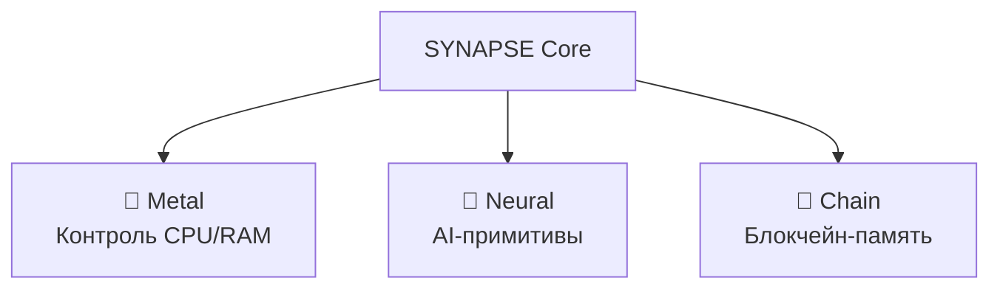
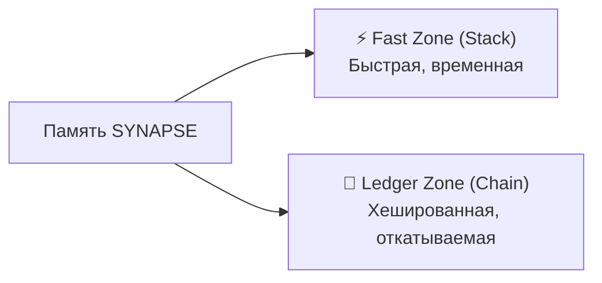

# SYNAPSE LANGUAGE SPECIFICATION

**Версия:** 0.2 (Draft)  
**Статус:** В разработке  
**База:** TITAN v0.18.0 (FASM)  
**Тип:** Bare-metal, Systems, AI-Native, Ledger-Oriented

---

## 1. Обзор

**SYNAPSE** — компилируемый язык программирования низкого уровня с абстракциями высокого уровня для искусственного интеллекта и криптографии.

### 1.1 Название и Философия

- **Связь с AI:** Синапс — место контакта между нейронами
- **Связь с Блокчейном:** Синапс — узел передачи сигнала в P2P-сети
- **Связь с Железом:** Электрический импульс, скорость

### 1.2 Уникальные Особенности

| Особенность | Описание |
|-------------|----------|
| **AI-Native** | Типы `Tensor`, `Neuron` встроены в ядро языка |
| **No-OS** | Программы компилируются в загрузочные образы |
| **Ledger-Oriented (LOP)** | Блокчейн-память с Merkle Tree |
| **Adaptive SIMD** | Автоопределение AVX-512/AVX2/SSE |
| **P2P-Native** | Децентрализованная синхронизация |
| **Time-Travel Debugging** | Откат состояния программы |

---

## 2. Архитектура

### 2.1 Модель исполнения "No-OS"

**Традиционный подход:**
```
Железо → ОС (Windows/Linux) → Язык → Программа
```

**Подход SYNAPSE:**
```
Железо → SYNAPSE Runtime/Kernel → Программа
```

Программа на SYNAPSE может компилироваться в `bootable ISO`, не требуя внешней операционной системы.

### 2.2 Принцип "Tri-Core" (Три Ядра)



1. **Metal:** Полный контроль над регистрами CPU и памятью (как в ASM/C)
2. **Neural:** ИИ-примитивы являются встроенными типами (аппаратно ускоренные)
3. **Chain:** Память управляется как неизменяемый реестр (Blockchain)

### 2.3 Adaptive Vector Engine (AVE)

Ядро языка включает динамический диспетчер инструкций. При компиляции SYNAPSE проверяет `CPUID`:

| Уровень | Требования | Регистры | Описание |
|---------|-----------|----------|----------|
| **Tier 1 (Titan)** | AVX-512 / VNNI | ZMM (512-бит) | AMD Zen 4+, Intel Xeon |
| **Tier 2 (Core)** | AVX2 / FMA | YMM (256-бит) | Intel Core 12+, Ryzen 5000 |
| **Tier 3 (Legacy)** | SSE4.2 | XMM (128-бит) | Старые CPU |

---

## 3. Система Типов

### 3.1 Базовые типы (Metal)

| Тип | Размер | Описание |
|-----|--------|----------|
| `byte` | 8 бит | Беззнаковый байт |
| `int8`..`int64` | 8-64 бит | Целые числа со знаком |
| `uint8`..`uint64` | 8-64 бит | Целые числа без знака |
| `f32` | 32 бит | Float (IEEE 754) |
| `f64` | 64 бит | Double (IEEE 754) |
| `ptr` | 64 бит | "Умный" указатель с проверкой границ |
| `bool` | 8 бит | Булевый тип |

### 3.2 Нейро-типы (Neural)

Эти типы автоматически обрабатываются через SIMD/AVX инструкции.

| Тип | Описание | Пример |
|-----|----------|--------|
| `tensor<T, shape>` | Многомерный массив | `tensor<f32, [1024, 1024]>` |
| `quant8` | 8-битные квантованные веса | Для VNNI инструкций |
| `neuron` | Функция активации | ReLU, Sigmoid, Tanh |

```synapse
let weights: tensor<f32, [784, 128]>  // Матрица весов
let input: tensor<f32, [784]>          // Входной вектор
let output = input <dot> weights       // MATMUL через AVX
```

### 3.3 Крипто-типы (Chain)

| Тип | Размер | Описание |
|-----|--------|----------|
| `hash256` | 256 бит | Результат SHA-256/BLAKE3 |
| `sign` | 512 бит | Цифровая подпись Ed25519 |
| `block` | Variable | Структура блока (данные + хеш) |
| `transaction` | Variable | Транзакция с метаданными |

```synapse
let message = "Hello SYNAPSE"
let fingerprint: hash256 = sha256(message)  // Аппаратное ускорение AES-NI
```

---

## 4. Модель Памяти: "Merkle Heap"

### 4.1 Две Зоны Памяти



| Зона | Назначение | Особенности |
|------|------------|-------------|
| **Fast Zone** | Временные переменные | Как обычный стек в C |
| **Ledger Zone** | Критические данные | Merkle Tree, транзакции, rollback |

### 4.2 Транзакционная Память

```synapse
// Переменная в Ledger Zone
chain let balance: int = 1000

// Изменение создаёт транзакцию
balance -= 100  // Записывается в историю

// Откат состояния
chain.rollback(5)  // Вернуть состояние на 5 транзакций назад
```

### 4.3 Защита Целостности

- Любое изменение в Ledger Zone обновляет хеш корня Merkle Tree
- Если байт изменён эксплойтом — хеш не совпадает → `Panic`
- Невозможно тайно модифицировать данные

---

## 5. Криптографические Примитивы

### 5.1 Встроенные Функции

| Функция | Описание | Аппаратное ускорение |
|---------|----------|---------------------|
| `sha256(data)` | SHA-256 хеш | SHA Extensions |
| `blake3(data)` | BLAKE3 хеш | AVX2 |
| `ed25519_sign(data, key)` | Подпись | - |
| `ed25519_verify(data, sign, pubkey)` | Проверка | - |

### 5.2 Смарт-контракты

```synapse
// Функция выполняется только при валидной подписи
contract fn transfer_money(amount: int) signed_by(AdminKey):
    if amount > balance:
        return Error("Insufficient funds")
    
    balance -= amount
    chain.commit()  // Фиксация в блокчейн
```

---

## 6. Параллельность и P2P

### 6.1 Легковесные Корутины (Goroutines)

```synapse
// Запуск миллиона задач
spawn fn worker(id: int):
    // Легковесный поток
    process_data(id)

for i in 0..1000000:
    spawn worker(i)
```

### 6.2 Синхронизация по Сети

```synapse
// Переменная синхронизируется между узлами P2P
global chain let shared_state: List<Transaction>

// Изменение автоматически отправляется всем узлам
shared_state.append(new_transaction)
```

---

## 7. Inline Assembler

### 7.1 Безопасные Вставки

```synapse
fn low_level_trick() -> int:
    let result: int = 0
    
    unsafe asm:
        MOV RAX, 1
        CPUID
        MOV [result], RBX
    
    return result
```

### 7.2 Прямой Доступ к Памяти

```synapse
fn vga_print(message: string):
    let vga_buffer: ptr = 0xB8000  // VGA text mode
    
    for i, char in message:
        unsafe:
            *vga_buffer = char
            vga_buffer += 2
```

---

## 8. Стандартная Библиотека (Core Modules)

| Модуль | Описание |
|--------|----------|
| `core.io` | Ввод-вывод, файлы |
| `core.vga` | VGA текстовый режим |
| `core.ai` | Нейросетевые операции |
| `core.crypto` | Криптографические функции |
| `core.chain` | Блокчейн-операции |
| `core.net` | P2P сетевые функции |
| `core.simd` | Низкоуровневые SIMD операции |

---

## 9. Компилятор

### 9.1 Режимы Компиляции

| Режим | Вывод | Использование |
|-------|-------|---------------|
| **JIT** | Исполнение в памяти | REPL, отладка |
| **Native** | `.exe` / ELF | Обычные программы |
| **Bare-Metal** | Bootable ISO | No-OS приложения |

### 9.2 Оптимизации

- Автоматическая векторизация циклов
- Адаптивный выбор SIMD инструкций
- Константное свёртывание
- Инлайнинг функций

---

## 10. Совместимость с TITAN

SYNAPSE наследует ядро от TITAN v0.18.0:

| Компонент TITAN | Статус в SYNAPSE |
|-----------------|------------------|
| JIT Engine | ✅ Переносится без изменений |
| AVX2 SIMD | ✅ Расширяется до AVX-512 |
| FFI (Windows API) | ✅ Выносится в Platform Layer |
| BASIC синтаксис | ❌ Заменяется на современный |
| Heap Memory | 🔄 Модернизируется в Merkle Heap |

---

*© 2025 mjojo & GLK-Dev. SYNAPSE Language Specification.*
