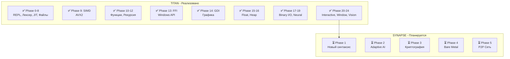

# TITAN → SYNAPSE: Анализ Текущего Состояния

**Дата анализа:** 2025-12-20  
**Версия TITAN:** v0.20.0 (Phase 24 в исходниках)  
**Версия в README:** v0.18.0 (требует обновления)

---

## 📊 Сводка



---

## ✅ Реализованные Фазы TITAN

### Ядро (Phases 0-8)

| Фаза | Статус | Описание | Файлы |
|------|--------|----------|-------|
| **Phase 0** | ✅ 100% | Инфраструктура, REPL | `main.asm` |
| **Phase 1** | ✅ 100% | Лексер (токенизатор) | `lexer.asm` |
| **Phase 2** | ✅ 100% | JIT-ядро, VirtualAlloc | `jit_emit.asm` |
| **Phase 3** | ✅ 100% | Переменные A-Z | `main.asm` |
| **Phase 4** | ✅ 100% | Арифметика +,-,*,/,^ | `main.asm` |
| **Phase 5** | ✅ 100% | GOTO, IF/THEN/ELSE | `main.asm` |
| **Phase 6** | ✅ 100% | FOR/NEXT циклы | `main.asm` |
| **Phase 7** | ✅ 100% | Строки, PRINT, конкатенация | `main.asm` |
| **Phase 8** | ✅ 100% | SAVE/LOAD, INPUT | `main.asm` |

### SIMD и Производительность (Phase 9)

| Компонент | Статус | Детали |
|-----------|--------|--------|
| CPUID Detection | ✅ | Определение AVX2 |
| VDIM | ✅ | Векторные массивы |
| VADD/VSUB/VMUL | ✅ | Векторные операции |
| VPRINT | ✅ | Вывод векторов |

### Функции (Phases 10-12)

| Компонент | Статус | Детали |
|-----------|--------|--------|
| GOSUB/RETURN | ✅ | Подпрограммы |
| REM | ✅ | Комментарии |
| FUNC/ENDFUNC | ✅ | Именованные функции |
| LOCAL | ✅ | Локальные переменные |
| Рекурсия | ✅ | Полная поддержка (factorial, fibonacci) |

### FFI и Графика (Phases 13-14)

| Компонент | Статус | Детали |
|-----------|--------|--------|
| MSGBOX | ✅ | MessageBoxA из user32.dll |
| DECLARE | ✅ | Загрузка произвольных DLL |
| LoadLibrary/GetProcAddress | ✅ | Динамическая FFI |
| GDI WINDOW | ✅ | Создание окна |
| GDI PIXEL/LINE | ✅ | SetPixel, LineTo |

### Числа и Память (Phases 15-16)

| Компонент | Статус | Детали |
|-----------|--------|--------|
| Float64 | ✅ | Полная поддержка double |
| DIM массивы | ✅ | До 1 MB на куче |
| var_types | ✅ | Типизация переменных |

### Нейросетевой Движок (Phases 17-19)

| Компонент | Статус | Детали |
|-----------|--------|--------|
| BLOAD/BSAVE | ✅ | Бинарные файлы |
| MATMUL | ✅ | Умножение матриц (AVX2+FMA) |
| VRELU | ✅ | ReLU активация (SIMD) |
| MNIST Inference | ✅ | 96.37% точность! |

### Интерактивность и Визуализация (Phases 20-24)

| Компонент | Статус | Детали |
|-----------|--------|--------|
| MOUSE | ✅ | Чтение координат мыши |
| KEYDOWN | ✅ | Проверка клавиш |
| SLEEP | ✅ | Пауза выполнения |
| WINDOW | ✅ | Создание графического окна |
| PSET | ✅ | Рисование пикселей в буфер |
| UPDATE | ✅ | Обновление экрана |
| WCLS | ✅ | Очистка окна |
| CAPTURE | ✅ | Захват экрана в массив |
| DOWNSAMPLE | ✅ | Масштабирование изображения |
| ARRADD | ✅ | Операции с массивами |
| GPRINT | ✅ | Вывод текста (bitmap font 8x8) |

---

## 📈 Прогресс по Версиям

```
TITAN v0.1.0   [████████████████████] Phase 0-2  — REPL + JIT
TITAN v0.8.0   [████████████████████] Phase 3-8  — Полный BASIC
TITAN v0.13.0  [████████████████████] Phase 9-13 — SIMD + FFI (14 KB)
TITAN v0.18.0  [████████████████████] Phase 14-19— Neural Engine (21 KB)
TITAN v0.20.0  [████████████████████] Phase 20-24— Vision, Interactive ← ТЕКУЩИЙ
```

---

## 🔄 Сравнение: TITAN vs SYNAPSE Plan

### Что уже есть в TITAN и переносится в SYNAPSE:

| Компонент | TITAN | SYNAPSE | Статус |
|-----------|-------|---------|--------|
| JIT Engine (x64) | ✅ | → Переносится | Готов |
| AVX2 SIMD | ✅ | → Расширяется до AVX-512 | Готов |
| MATMUL/VRELU | ✅ | → `tensor<dot>` оператор | Готов |
| FFI (Windows) | ✅ | → Platform Abstraction Layer | Готов |
| Heap Memory | ✅ | → Merkle Heap (Phase 3) | Нужно переписать |
| BLOAD/BSAVE | ✅ | → `load_tensor()` | Готов |
| Graphics Window | ✅ | → `core.vga` модуль | Готов |
| Neural Inference | ✅ | → `core.ai` модуль | Готов |

### Что нужно добавить для SYNAPSE:

| Компонент | SYNAPSE Phase | Описание | Сложность |
|-----------|---------------|----------|-----------|
| **Новый синтаксис** | Phase 1 | Python-like с отступами | ⭐⭐⭐ |
| **Система типов** | Phase 1 | `let`, `mut`, `tensor<T>` | ⭐⭐⭐ |
| **CPUID Tiers** | Phase 2 | AVX-512/AVX2/SSE автовыбор | ⭐⭐ |
| **quant8 (VNNI)** | Phase 2 | 8-битные веса для AI | ⭐⭐⭐ |
| **SHA-256/BLAKE3** | Phase 3 | Криптографические примитивы | ⭐⭐⭐⭐ |
| **Merkle Allocator** | Phase 3 | Блокчейн-память | ⭐⭐⭐⭐⭐ |
| **ed25519** | Phase 3 | Цифровые подписи | ⭐⭐⭐⭐ |
| **UEFI Bootloader** | Phase 4 | No-OS запуск | ⭐⭐⭐⭐⭐ |
| **Physical Memory** | Phase 4 | Управление RAM | ⭐⭐⭐⭐ |
| **Network Driver** | Phase 5 | P2P протокол | ⭐⭐⭐⭐⭐ |

---

## 📝 Расхождения README vs Исходники

> [!WARNING]
> README.md указывает v0.18.0, но исходники уже на v0.20.0!

### Нужно обновить:

1. **README.md** — обновить версию до v0.20.0
2. **ROADMAP.md** — добавить Phases 20-24
3. **docs/commands.md** — добавить WINDOW, PSET, CAPTURE, GPRINT, etc.

### Новые команды в v0.20.0 (не документированы):

| Команда | Описание |
|---------|----------|
| `WINDOW w, h, "title"` | Создание графического окна |
| `PSET x, y, color` | Пиксель в буфер (быстро) |
| `UPDATE` | Обновить окно |
| `WCLS` | Очистить окно |
| `CAPTURE array` | Захват экрана |
| `DOWNSAMPLE x,y,w,h,arr,scale` | Масштабирование |
| `GPRINT x, y, "text", color, scale` | Вывод текста |
| `MOUSE x, y` | Координаты мыши |
| `KEYDOWN key` | Проверка клавиши |
| `SLEEP ms` | Пауза |

---

## 🎯 Рекомендуемый Порядок Работ

### Немедленно:
1. **Обновить документацию** — синхронизировать README с v0.20.0
2. **Создать tests/** — автотесты (Phase Z.1 в ROADMAP)

### Для SYNAPSE Phase 1:
1. **Platform Abstraction Layer** — вынести Windows API в `sys_interface.asm`
2. **Новый лексер** — INDENT/DEDENT токены
3. **Новый парсер** — `fn`, `let`, `if:` синтаксис

### Технический долг:
- [ ] Crash Handler (только частично реализован)
- [ ] Linux поддержка (только Windows)
- [ ] Автотесты

---

## 📊 Метрики Кодовой Базы

| Файл | Строки | Размер |
|------|--------|--------|
| `src/main.asm` | 9,081 | 274 KB |
| `src/lexer.asm` | ~500 | 14 KB |
| `src/jit_emit.asm` | ~300 | 8 KB |
| `docs/grammar.md` | 436 | 11 KB |
| `docs/commands.md` | 280 | 9 KB |
| **Итого** | ~10,600 | ~316 KB |

### Размер бинарника:

| Версия | Размер | Добавлено |
|--------|--------|-----------|
| v0.13.0 | 14 KB | FFI |
| v0.14.0 | 15 KB | +GDI |
| v0.15.0 | 17 KB | +Float64 |
| v0.16.0 | 18 KB | +Heap |
| v0.17.0 | 19 KB | +BLOAD/BSAVE |
| v0.18.0 | 21 KB | +MATMUL/VRELU |
| v0.20.0 | ~25 KB | +Window/Vision (оценка) |

---

## 🚀 Готовность к SYNAPSE

```
Ядро JIT:          ████████████████████ 100%
SIMD (AVX2):       ████████████████████ 100%
Neural Engine:     ████████████████████ 100%
FFI/Interop:       ████████████████████ 100%
Graphics:          ████████████████████ 100%
────────────────────────────────────────────
Новый синтаксис:   ░░░░░░░░░░░░░░░░░░░░ 0%
Система типов:     ░░░░░░░░░░░░░░░░░░░░ 0%
Криптография:      ░░░░░░░░░░░░░░░░░░░░ 0%
Merkle Memory:     ░░░░░░░░░░░░░░░░░░░░ 0%
Bare Metal:        ░░░░░░░░░░░░░░░░░░░░ 0%
P2P Network:       ░░░░░░░░░░░░░░░░░░░░ 0%
```

**Вывод:** TITAN v0.20.0 — это зрелая платформа с мощным JIT-движком, SIMD-ускорением и нейросетевым инференсом. Все базовые компоненты для SYNAPSE готовы. Следующий шаг — рефакторинг синтаксиса и добавление системы типов.

---

*© 2025 mjojo & GLK-Dev. TITAN/SYNAPSE Analysis.*
